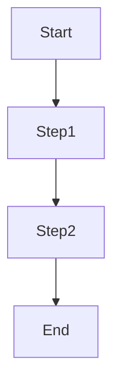



## Basic Concepts

This section introduces definitions, background, and formulas.

## Diagram (Mermaid)



## Example Code (Optional)

```python
import numpy as np
# Example code
```

## Summary

Brief review of this section.

---

## Further Reading

- Reference 1
- Blog 2
