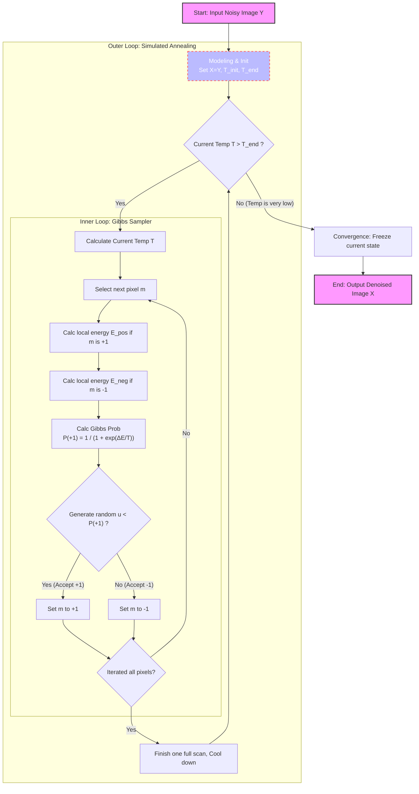

> MCs are in time, while MRFs are in space

## From Time to Space—Crossing the Dimensions of Markov Assumption

Before officially introducing **Markov Random Fields (MRF)**, let's review **Markov Chains**.

### The Limitation of Markov Chains: The Unidirectionality of Time

Imagine you are recording the weather every day. In the assumption of a Markov Chain, today's weather $x_n$ only depends on yesterday's weather $x_{n-1}$, and has nothing to do with the day before yesterday or earlier. Expressed in probability formula:
$$P(x_n | x_0, x_1, \dots, x_{n-1}) = P(x_n | x_{n-1})$$

This model is very useful for processing one-dimensional, discrete **Time Series**. However, the real world is not just about time. What if we are facing a two-dimensional photo, or a three-dimensional space? At this time, the "chain" with only sequential relationships is not enough. After all, for cases spanning more than one dimension, how do we define sequential relationships?

### Introducing Lattice and Random Field

To solve two-dimensional or high-dimensional spatial problems, we need to extend the one-dimensional "line" into a two-dimensional "net"—this is the **Lattice**.

Suppose we have a black and white image composed of pixels. The position of each pixel can be represented by coordinates $m = (i, j)$.
At each point on this grid, we place a **Random Variable (RV)**, for example, $X_{i,j}$ represents whether this pixel is black or white.

When these $N \times M$ random variables are combined, they constitute a **Random Field**. We are not just concerned with a single point; we are concerned with the **Joint Distribution** of all variables in the entire field:

$$P(X) = P(X_1, X_2, \dots, X_{NM})$$

This leads to the core difficulty of MRF: in a grid with thousands of pixels, calculating the joint probability of all points is astronomically difficult. We must find a way to simplify it, and this is where "Markov property" comes into play in this space.


```python
import numpy as np
import matplotlib.pyplot as plt

def create_random_field(rows, cols):
    """
    Create a simple 2D Random Field (Lattice)
    Here we assume each lattice point (random variable) has only two states: 1 (yellow) or -1 (purple)
    """
    # Randomly initialize an N x M grid, values between {-1, 1}
    lattice = np.random.choice([-1, 1], size=(rows, cols))
    return lattice

def plot_lattice(lattice, title="2D Random Field (Lattice)"):
    """
    Visualize the lattice
    """
    plt.figure(figsize=(6, 6))
    # Use matshow to draw the grid
    plt.matshow(lattice, cmap='viridis', fignum=1)
    
    # Draw grid lines to clearly see the concept of "lattice points"
    rows, cols = lattice.shape
    for i in range(rows):
        plt.axhline(i - 0.5, color='white', linewidth=1)
    for j in range(cols):
        plt.axvline(j - 0.5, color='white', linewidth=1)
        
    plt.title(title, pad=20)
    plt.xticks([]) # Hide axis numbers
    plt.yticks([])
    plt.show()

# 1. Initialize a 10x10 random field
N, M = 10, 10
my_field = create_random_field(N, M)

# 2. Visualize
plot_lattice(my_field, title="Initial Random Field (No Rules Applied)")
```


    

    


In the figure above, you will see a bunch of chaotic color blocks. This is because in the current random field, each point is completely independent and has no pattern. But in the real world (such as in natural images), adjacent pixels often have similar colors.

This raises a question: How can we use mathematical language to add the rule that "adjacent points affect each other" into this field?

## Building Social Networks—Neighbors, Markov Property, and Cliques

To transfer the elegant "local dependency" property of Markov Chains to this spatial field, we need to introduce the concept of "distance" or "neighborhood".

### 1. Who are my Neighbors?

In MRF, we use $\Delta_m$ to represent the "Neighborhood" of point $m$.

How to define neighbors? In image processing or spatial models, the most common are two types:
* **4-Neighborhood (Cross)**: Only look at the four points: up, down, left, and right.
* **8-Neighborhood (Grid)**: Includes diagonal points, a total of eight.


Which neighborhood shape and size to choose depends entirely on the specific problem you want to solve. However, no matter how you choose, mathematically you must strictly abide by two **Iron Rules**:

1. **Not including itself**: A point cannot be its own neighbor ($m \notin \Delta_m$).
2. **Absolute symmetry**: If A is a neighbor of B, then B must also be a neighbor of A ($A \in \Delta_B \iff B \in \Delta_A$).

### 2. Spatial Markov Property in MRF

With neighbors, we can finally write the core mathematical definition of MRF.

Let $X_{-m}$ represent all other points on the grid except point $m$. Then, the spatial Markov property can be expressed as:

$$P(X_m | X_{-m}) = P(X_m | X_{\Delta m})$$

**Translating this formula into plain language:**

> "If you want to predict the state of point $m$, you don't need to look at the entire universe (the whole picture), you only need to look at its few neighbors ($\Delta_m$)."

This great equation instantly reduces a global complex calculation into a local simple calculation!

### 3. Social Cliques: The Clique

Since adjacent points affect each other, we need a basic mathematical structure to quantify this influence. Here, it is the "**Clique**".

* **What is a Clique?** A clique is a subset on the grid. In this subset, any two nodes are either the same point or neighbors of each other. In short, it must be "connected" according to the neighborhood rules you defined.
* **Order of the Clique:** The number of nodes contained in the clique is its order.
  * **Order 1 Clique**: A lonely single point.
  * **Order 2 Clique**: A line connecting two adjacent points.
  * *(Note: If you use 8-neighborhood, there will also be order 3 cliques formed by three points in a triangle, etc.)*


We will assign a **Clique Potential ($U_c$)** to each "clique". For example, the potential of an order 2 clique $U(X) = X_a X_b$ can be used to evaluate whether the colors of two adjacent pixels are consistent.

#### Physical Intuition: What is "Potential"?
In physics, **the lower the Potential (Energy), the more stable the system**.
- Imagine a stone on a hillside: it has high potential energy at the top (unstable, wants to roll down); it has the lowest potential energy at the bottom of the valley (most stable, doesn't want to move).
- In probability theory: **The more stable the system, the greater the probability of this happening**.

So, in MRF, we design "potential" for only one purpose: **to score different states**.
- Low Potential = This is a good state (conforms to common sense, high probability).
- High Potential = This is a bad state (abnormal, low probability).

#### On the Lattice: Potential is "Penalty/Reward Rule"
The potential function $U_c$ is the scoring rule we tailor for this small group.

Let's take the classic black and white image denoising as an example. Suppose the pixel values are only two types: $+1$ (white) and $-1$ (black).
- Rule A: Order 1 Clique Potential
  - An order 1 clique is a lonely point. Its potential $U(X_a)$ usually represents **"what this point itself looks like"**.
  - Suppose we have a noisy observation image $Y$. If the currently estimated pixel $X_a$ is different from the actually observed pixel $Y_a$, we penalize it (potential becomes higher).
- Rule B: Order 2 Clique Potential
  - An order 2 clique is two adjacent points $X_a$ and $X_b$.
  - In a real picture, two adjacent pixels are likely to be the same color (either both black or both white). How do we express "encourage same color, penalize different color" in mathematical formulas?
    - To make the "good state" have low potential, we rewrite it slightly, adding a negative sign defined as: $$U(X_a, X_b) = - X_a X_b$$
      - If $X_a$ and $X_b$ are the same color (both $+1$ or both $-1$): $$X_a \cdot X_b = 1$$$$U = -1$$ (Potential is lowered! The system is rewarded and becomes more stable)
      - If $X_a$ and $X_b$ are different colors (one is $+1$, one is $-1$): $$X_a \cdot X_b = -1$$$$U = +1$$ (Potential is raised! The system is penalized and becomes unstable)
      - So, the potential function $U_c$ is actually a "detector". It patrols everywhere on the grid, and every time it sees a pair of adjacent pixels, it calculates with $X_a X_b$. If it finds that their colors are different, it adds a little to the total energy; if the colors are the same, it subtracts a little.

Therefore, in MRF, the potential $U_c$ is the mathematical formula you artificially set to describe the "tacit understanding" between local nodes.
- The more two points "violate common sense" (e.g., should be the same color but are different), the greater the potential.
- The more two points "conform to common sense", the smaller the potential.

### Python Visual Example

#### Finding Neighbors and Building Cliques

To implement Markov property in code, we need to write a function specifically to find the "neighbors" of a pixel.


```python
import numpy as np
import matplotlib.pyplot as plt

def get_neighbors(lattice, row, col, mode='4-way'):
    """
    Get the neighbor coordinates of a specified position (row, col) in the grid
    """
    rows, cols = lattice.shape
    neighbors = []
    
    # 4-Neighborhood (Up, Down, Left, Right)
    if mode == '4-way':
        directions = [(-1, 0), (1, 0), (0, -1), (0, 1)] 
    # 8-Neighborhood
    elif mode == '8-way':
        directions = [(-1, 0), (1, 0), (0, -1), (0, 1), 
                      (-1, -1), (-1, 1), (1, -1), (1, 1)]
    
    for dr, dc in directions:
        r, c = row + dr, col + dc
        # Boundary check: ensure neighbors do not go outside the image
        if 0 <= r < rows and 0 <= c < cols:
            neighbors.append((r, c))
            
    return neighbors

def plot_neighbors_and_cliques():
    """Visualize Neighborhood and Order 2 Cliques"""
    lattice = np.zeros((6, 6))
    
    # Select center point m
    center_r, center_c = 2, 2
    lattice[center_r, center_c] = 2 # Set to 2 (Yellow represents center point)
    
    # Get 4-Neighborhood neighbors
    neighbors = get_neighbors(lattice, center_r, center_c, mode='4-way')
    
    # Mark neighbors as 1 (Green)
    for r, c in neighbors:
        lattice[r, c] = 1 
        
    plt.figure(figsize=(6, 6))
    plt.matshow(lattice, cmap='viridis', fignum=1)
    
    # Draw grid lines
    rows, cols = lattice.shape
    for i in range(rows): plt.axhline(i - 0.5, color='white', linewidth=2)
    for j in range(cols): plt.axvline(j - 0.5, color='white', linewidth=2)
    
    # Draw connection lines for Order 2 Cliques (Connecting center point and its neighbors)
    for r, c in neighbors:
        plt.plot([center_c, c], [center_r, r], color='red', linewidth=3, linestyle='--')
        
    plt.title("Center Point (Yellow), 4-Neighbors (Green)\nRed lines represent 2nd-Order Cliques", pad=20)
    plt.xticks([])
    plt.yticks([])
    plt.show()

# Run visualization
plot_neighbors_and_cliques()
```


    

    


In the figure above, you will see red dashed lines connecting the center point and its neighbors. Each **red line** and the two points at its ends constitute an **Order 2 Clique**!

Now, the blueprint is drawn. But in nature, water flows downwards, and systems always tend to be stable. How do we combine these local "cliques" to calculate the energy of the entire random field?

#### Calculating Potential


```python
# Suppose this is two adjacent pixels
x_a = 1  # Pixel A is white
x_b = -1 # Pixel B is black

# 1. Define our designed Order 2 Clique Potential function U(x_a, x_b) = - x_a * x_b
def clique_potential_order2(pixel1, pixel2):
    return - (pixel1 * pixel2)

# 2. Calculate their potential
energy = clique_potential_order2(x_a, x_b)

print(f"Pixel A: {x_a}, Pixel B: {x_b}")
print(f"The potential of this pair of adjacent pixels is: {energy}") 
# Result will be +1, because they are different colors, the system is unhappy (potential rises).
```

    Pixel A: 1, Pixel B: -1
    The potential of this pair of adjacent pixels is: 1


## From Energy to Probability—Gibbs Distribution and Equivalence Theorem

Now, we know how to use "Clique Potential" $U_c(x)$ to score the "tacit understanding" of adjacent pixels. Now, let's zoom out from local to global.

### 1. The Global Ruler: Gibbs Energy

If we add up the potentials of all possible "cliques" on the grid (such as all single points, all adjacent pixel pairs), we get the total energy of the entire system (the entire image), called **Gibbs Energy**:

$$E(\underline{X}) = \sum_{c} U_c(\underline{X})$$

* **Physical Intuition**: If the whole picture is very smooth and natural, everyone is very "tacit", the total energy $E$ will be very low; if the picture is full of noise, like a snowy screen, the total energy $E$ will be extremely high.

### 2. From Energy to Probability: Gibbs Distribution

We have energy, but what we ultimately need in statistics is **Probability**. How to turn energy into probability? Statistical physics gives us a perfect formula—**Gibbs Distribution**:
$$P(x) = A e^{-\lambda E(x)}$$

* $E(x)$ is the Gibbs energy we just calculated.
* $A$ is a normalization constant to ensure that the sum of probabilities of all possible states equals 1. Its calculation formula is $A = \frac{1}{\int e^{-\lambda E(x)} dx}$.
* **The Magic of the Negative Sign**: Note the negative sign on the exponent. The lower the energy $E(x)$, the larger $-E(x)$, and the higher the calculated probability $P(x)$! This perfectly fits the natural law of "water flows downwards, the more stable the system (low energy), the more likely it is to appear".

### 3. The Crown Jewel of MRF: Hammersley-Clifford Theorem

At this point, you might ask: What does this have to do with the "Markov Random Field (MRF)" we talked about in the first section?

This leads to one of the greatest theorems in probabilistic graphical models:

**If the probability distribution of a random field is a Gibbs distribution, then it must be a Markov Random Field (MRF), and vice versa**.

Abbreviated as:

$$MRF \iff Gibbs$$

**Why is this theorem so awesome?**

Because defining a macroscopic joint probability distribution containing tens of thousands of nodes is an impossible task. But this theorem tells us: **You don't need to calculate that astronomical joint probability! You only need to define the potential rules $U_c(x)$ for each small group (clique) microscopically, and then add them up, and you naturally get a perfect field that satisfies the Markov property!**

### 4. The Moment of Miracle: The Proof

We want to prove: In a grid that obeys the Gibbs distribution, the state of a point $m$ is only related to its neighbors (i.e., satisfying Markov property $P(X_m | X_{-m}) = P(X_m | X_{\Delta m})$).

**Step 1: Write Conditional Probability**

According to the basic conditional probability formula $P(A|B) = \frac{P(AB)}{P(B)}$, we can write the conditional probability of point $m$:
$$P(X_m | X_{-m}) = \frac{P(X_m, X_{-m})}{P(X_{-m})} = \frac{P(X)}{\sum_{X_m} P(X)}$$

**Step 2: Substitute Gibbs Distribution**

Substitute $P(X) = A e^{-\lambda E(X)}$ into the above formula, the constant $A$ is canceled out directly in the numerator and denominator:
$$= \frac{e^{-\lambda E(\underline{x})}}{\sum_{X_m} e^{-\lambda E(\underline{x})}}$$

**Step 3: Split Energy**

We know the total energy $E(X) = \sum_c U_c(X)$.
For the thousands of cliques on the grid, we can forcibly divide them into two categories:
1. **Cliques containing point $m$**: $\sum_{m \in c} U_c(X)$
2. **Cliques NOT containing point $m$**: $\sum_{m \notin c} U_c(X)$

Substitute these two parts back into the exponent, using $e^{a+b} = e^a \cdot e^b$:
$$= \frac{e^{-\lambda \sum_{m \in c} U_c(x)} \cdot e^{-\lambda \sum_{m \notin c} U_c(x)}}{\sum_{X_m} \left[ e^{-\lambda \sum_{m \in c} U_c(x)} \cdot e^{-\lambda \sum_{m \notin c} U_c(x)} \right]}$$

**Step 4: Perfect Cancellation**

Note that the denominator is summing over $X_m$. For those cliques that do not contain point $m$ ($\sum_{m \notin c} U_c(x)$), their values have absolutely nothing to do with what $X_m$ takes!

So when summing over $X_m$, this term is equivalent to a constant and can be extracted directly outside the summation sign.

After extracting, it cancels out perfectly with the exact same term in the numerator! Finally, only the cliques containing point $m$ are left:
$$= \frac{e^{-\lambda \sum_{m \in c} U_c(x)}}{\sum_{X_m} e^{-\lambda \sum_{m \in c} U_c(x)}}$$


**Conclusion:**

Look at the formula left at the end, all calculations only depend on "cliques containing point $m$". And according to the definition of "clique", in a clique containing point $m$, besides $m$ itself, there are only neighbors of $m$, $\Delta_m$!
This perfectly proves:
$$P(X_m | X_{-m}) = P(X_m | X_{\Delta m})$$


### Python Visual Example: Energy to Probability

We can write a simple function to intuitively feel how energy $E$ turns into probability $P$ through the Gibbs formula.


```python
import numpy as np
import matplotlib.pyplot as plt

def gibbs_probability(energies, lambda_param=1.0):
    """
    Convert a set of energy values to Gibbs probability distribution
    P(x) \\propto e^{-\\lambda E(x)}
    """
    # Calculate unnormalized weights e^{-\lambda E(x)}
    weights = np.exp(-lambda_param * np.array(energies))
    
    # Normalize (divide by sum A), so that probabilities sum to 1
    probabilities = weights / np.sum(weights)
    return probabilities

# Suppose we have three states and calculated their total energies
# State A: Very low energy (Very stable)
# State B: Medium energy
# State C: Very high energy (Very abnormal)
energy_states = [1.5, 5.0, 12.0]
state_names = ['State A (Low E)', 'State B (Med E)', 'State C (High E)']

# Calculate probabilities
probs = gibbs_probability(energy_states, lambda_param=1.0)

# Print results
for name, e, p in zip(state_names, energy_states, probs):
    print(f"{name}: Energy = {e:5.1f}  -->  Probability = {p*100:6.2f}%")

# Visualize
plt.figure(figsize=(8, 4))
plt.bar(state_names, probs, color=['green', 'orange', 'red'])
plt.title("Gibbs Distribution: Lower Energy = Higher Probability")
plt.ylabel("Probability")
plt.show()
```

    State A (Low E): Energy =   1.5  -->  Probability =  97.07%
    State B (Med E): Energy =   5.0  -->  Probability =   2.93%
    State C (High E): Energy =  12.0  -->  Probability =   0.00%


    

    


Through the code above, you will find that state A with low energy occupies almost all the probability (97%), while state C with high energy has almost 0 probability of appearing.

Now, we have the theoretical weapon (equivalence of MRF and Gibbs) and know how to calculate probability. So, facing a rotten picture full of noise, how do we let the computer automatically find the perfect state with "lowest energy and maximum probability"?

## Finding the Optimal Solution—Simulated Annealing and Gibbs Sampling in Action



We now know the core logic of Gibbs distribution: **To keep the system in the perfect state with maximum probability, the total energy of the system must be minimized.**

In practical applications of MRF (such as image denoising, image segmentation), our **Overall Workflow** is very clear:

1. **Modeling (Model a MRF)**: Turn the problem into an MRF grid and define potential rules.
2. **Optimization**: Find the state with the highest conditional probability (lowest energy).
3. **Solving**: Use Simulated Annealing algorithm, combined with cooling low and Gibbs sampling technology to achieve multi-dimensional state updates.

There are two key "superheroes" in this solution plan:

### 1. Local Pathfinder: Gibbs Sampler

In an N-dimensional space with tens of thousands of variables, updating all variables at the same time will "explode". The cleverness of Gibbs sampling is: **Only stare at one point at a time, and treat all other points as wooden people (fixed immobile)**.

* **How to update this point?** This is the brightest moment of MRF! According to the Markov property we proved in the previous section, we **don't need to pay attention to the whole picture at all**, we only need to use the Markov property (exploiting the Markov property) and look at the few neighbors around this point.
* **Calculate Probability**: Calculate the local energy composed of it and its neighbors when this point turns black; and what the local energy is when it turns white. Then use the Gibbs formula to convert energy into probability, and roll a die (sample) to decide its new color.

### 2. Global Commander: Simulated Annealing

If only Gibbs sampling is used, the algorithm can easily get stuck in a local dead end that is "not bad but not the best". To find the global absolute optimal solution, we need to introduce the concept of **Temperature**.

The entire annealing process is divided into the following steps:

1. **High Temperature Exploration (Initial: Fix a high Temp $T_0$)**: Set a very high temperature $T_0$ at the beginning. At this time, the Gibbs distribution is very flat, and the algorithm is like a headless fly, which can easily accept "worse" results. This helps it jump out of local pits.
2. **Gradual Cooling (Decrease T)**: Let the temperature drop slowly ($T_0 > T_1 > T_2 > \dots > T_n$). As the temperature drops, the system becomes more and more picky, only tending to accept changes that "lower the energy".
3. **Temperature Law**: In pure theory, Geman & Geman proved that if the temperature is lowered extremely slowly according to the logarithmic law of $T(t) \sim \log(1/t + 1)$, the global optimal solution will definitely be found. But in engineering code, for speed, we usually use geometric cooling (multiply by 0.99 each time).
4. **Get Result**: At the lowest temperature $T_n$, the system will be "frozen" in the optimal solution with the lowest energy. We take the average (mean) of the final sampling results, which is the final answer we are looking for.


### Python in Action: Image Denoising with MRF

Let's write a code of less than 100 lines to feel this process. We will artificially create an image full of noise, and then use **MRF + Gibbs Sampling + Simulated Annealing** to let the computer "wash it clean" by itself!

This model has a famous name in academia: **Ising Model**.


```python
import numpy as np
import matplotlib.pyplot as plt

def add_noise(image, noise_ratio=0.2):
    """Add noise to a clean binary image"""
    noisy_img = np.copy(image)
    # Randomly generate noise mask
    mask = np.random.rand(*image.shape) < noise_ratio
    noisy_img[mask] = -noisy_img[mask] # Flip color (1 to -1, -1 to 1)
    return noisy_img

def get_local_energy(padded_X, Y, r, c, weight_data, weight_smooth):
    """
    Calculate local Gibbs energy (corresponding to Order 1 and Order 2 cliques)
    padded_X: Image of current state (added padding for easier boundary handling)
    Y: Observed noisy image
    r, c: Coordinates of current pixel in padded_X
    """
    # State of current pixel x_m
    x_m = padded_X[r, c]
    
    # 1. Order 1 Clique Potential (Data Term): Penalize if different from observed image Y
    # Note: Y has no padding, so coordinates are [r-1, c-1]
    # If x_m and Y are the same, x_m * Y = 1, add negative sign to become -1 (low energy, system rewarded)
    energy_data = - weight_data * (x_m * Y[r-1, c-1])
    
    # 2. Order 2 Clique Potential (Smoothness Term): Penalize if different from four neighbors
    # Get values of four neighbors: up, down, left, right
    neighbors_sum = (padded_X[r-1, c] + padded_X[r+1, c] + 
                     padded_X[r, c-1] + padded_X[r, c+1])
    # If x_m is same color as most neighbors, product > 0, add negative sign to become negative (low energy, system rewarded)
    energy_smooth = - weight_smooth * (x_m * neighbors_sum)
    
    return energy_data + energy_smooth

def mrf_denoising(Y, iter_max=15, T_init=5.0, T_end=0.1):
    """MRF Image Denoising (Using Gibbs Sampling and Simulated Annealing)"""
    rows, cols = Y.shape
    X = np.copy(Y) # Initial state starts from noisy image
    
    # Tau coefficient for geometric cooling
    tau = -np.log(T_end / T_init) / (iter_max - 1)
    
    for i in range(iter_max):
        T_curr = T_init * np.exp(-tau * i) # Calculate current temperature
        
        # Add a ring of 0 (padding) to the image for boundary handling
        padded_X = np.pad(X, 1, mode='constant')
        
        # Gibbs Sampling: Update pixel by pixel (Using Markov property, only look at neighbors)
        for r in range(1, rows + 1):
            for c in range(1, cols + 1):
                
                # Assume current pixel becomes 1, calc energy
                padded_X[r, c] = 1
                E_pos = get_local_energy(padded_X, Y, r, c, weight_data=1.0, weight_smooth=1.5)
                
                # Assume current pixel becomes -1, calc energy
                padded_X[r, c] = -1
                E_neg = get_local_energy(padded_X, Y, r, c, weight_data=1.0, weight_smooth=1.5)
                
                # Gibbs formula for probability: P(x=1) = exp(-E_pos/T) / (exp(-E_pos/T) + exp(-E_neg/T))
                # To prevent overflow, simplified to logistic form: 1 / (1 + exp((E_pos - E_neg) / T))
                delta_E = E_pos - E_neg 
                prob_pos = 1.0 / (1.0 + np.exp(delta_E / T_curr))
                
                # Roll the die to sample! Generate a random number 0~1
                if np.random.rand() < prob_pos:
                    padded_X[r, c] = 1
                else:
                    padded_X[r, c] = -1
                    
        # Strip padding, update the whole image, prepare for next iteration
        X = padded_X[1:-1, 1:-1] 
        print(f"Iteration {i+1:2d}/{iter_max}, Temp = {T_curr:.2f}")
        
    return X

# ----------------- Run and Visualize -----------------
print("Start generating test image...")
# 1. Create a 40x40 black and white cross test image
img_clean = -np.ones((40, 40))
img_clean[10:30, 15:25] = 1
img_clean[15:25, 10:30] = 1

# 2. Add noise (25% of pixels are flipped)
img_noisy = add_noise(img_clean, noise_ratio=0.25)

# 3. Use MRF for denoising
print("Start MRF Simulated Annealing denoising...")
img_denoised = mrf_denoising(img_noisy, iter_max=15, T_init=3.0, T_end=0.1)

# 4. Plot comparison
print("Denoising complete, generating comparison plot...")
fig, axes = plt.subplots(1, 3, figsize=(12, 4))

axes[0].imshow(img_clean, cmap='gray')
axes[0].set_title("Original (Ground Truth)")

axes[1].imshow(img_noisy, cmap='gray')
axes[1].set_title("Noisy Observation (Input)")

axes[2].imshow(img_denoised, cmap='gray')
axes[2].set_title("MRF Denoised Output")

for ax in axes: 
    ax.axis('off')
    
plt.tight_layout()
plt.show()
```

    Start generating test image...
    Start MRF Simulated Annealing denoising...
    Iteration  1/15, Temp = 3.00
    Iteration  2/15, Temp = 2.35
    Iteration  3/15, Temp = 1.85
    Iteration  4/15, Temp = 1.45
    Iteration  5/15, Temp = 1.14
    Iteration  6/15, Temp = 0.89
    Iteration  7/15, Temp = 0.70
    Iteration  8/15, Temp = 0.55
    Iteration  9/15, Temp = 0.43
    Iteration 10/15, Temp = 0.34
    Iteration 11/15, Temp = 0.26
    Iteration 12/15, Temp = 0.21
    Iteration 13/15, Temp = 0.16
    Iteration 14/15, Temp = 0.13
    Iteration 15/15, Temp = 0.10
    Denoising complete, generating comparison plot...


    

    


You will see three pictures. The input to the computer is a picture full of noise, like a snowy screen (middle picture).
But under the guidance of **MRF Potential Rules (encouraging adjacent pixels to be the same color)** and the overall control of **Simulated Annealing**, after 15 full-picture Gibbs sampling scans, the noise in the image disappeared miraculously like magic, almost perfectly restoring the original cross pattern (right picture)!

## Conclusion

This concludes this "Markov Random Field Introductory Guide".

From the **Lattice** that breaks the constraints of the time dimension, to the **Clique** that defines local connections; from the **Gibbs Distribution** that dominates everything, to the **Gibbs Sampling & Simulated Annealing** that peels off the cocoon.

I hope you can truly feel the suffocating mathematical beauty of probabilistic graphical models through this journey interwoven with mathematics and code!
