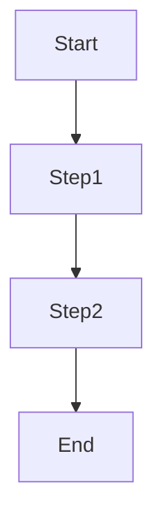



## 基本概念

这里介绍该部分的定义、背景、公式。

## 图示说明（Mermaid）


```mermaid
flowchart TD
    Start --> Step1 --> Step2 --> End
```

## 示例代码（可选）

```python
import numpy as np
# 示例代码
```

## 小结

本节简要回顾。

---

## 延伸阅读

- 文献1
- 博客2
