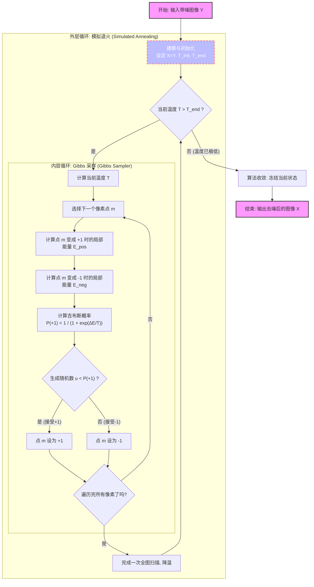

> MCs are in time, while MRFs are in space

## 从时间到空间——跨越维度的马尔可夫假设

在正式介绍马尔可夫随机场 (Markov Random Field, MRF) 之前，我们先回顾一下**马尔可夫链 (Markov Chain)**。

### 马尔可夫链的局限：时间的单向性

想象你正在记录每天的天气。在马尔可夫链的假设中，今天的天气 $x_n$ 只与昨天的天气 $x_{n-1}$ 有关，而与前天、大前天都无关 。用概率公式表达就是：
$$P(x_n | x_0, x_1, \dots, x_{n-1}) = P(x_n | x_{n-1})$$

这种模型处理一维的、离散的 **时间序列 (Time)** 非常好用。但是，现实世界并不只有时间。如果我们面对的是一张二维的照片，或者一个三维的空间呢？这时候，只有前后关系的“链”就不够用了。毕竟，对于超过一维的情况，要如何定义前后关系呢？

### 引入网格 (Lattice) 与随机场 (Random Field)

为了解决二维或高维空间的问题，我们需要把一维的“线”扩展成二维的“网”——这就是 **格点 (Lattice)** 。

假设我们有一张由像素组成的黑白图片。图片的每一个像素点的位置可以用坐标 $m = (i, j)$ 来表示 。
在这个网格上的每一个点，我们都放置一个 **随机变量 (Random Variables, RV)**，比如 $X_{i,j}$ 代表这个像素是黑还是白。

当这 $N \times M$ 个随机变量组合在一起时，它们就构成了一个 **随机场 (Random Field)** 。我们不仅关注某一个点，我们关注的是整个场里所有变量的 **联合分布 (Joint Distribution)**：

$$P(X) = P(X_1, X_2, \dots, X_{NM})$$

这就引出了 MRF 的核心难点：在一个拥有成千上万个像素的网格里，计算所有点的联合概率简直是天文数字。我们必须找到一种方法来简化它，这就是“马尔可夫性”要在这个空间里发挥的作用。


```python
import numpy as np
import matplotlib.pyplot as plt

def create_random_field(rows, cols):
    """
    创建一个简单的二维随机场 (Lattice)
    这里我们假设每个格点 (随机变量) 只有两种状态：1 (黄) 或 -1 (紫)
    """
    # 随机初始化 N x M 的网格，值在 {-1, 1} 之间
    lattice = np.random.choice([-1, 1], size=(rows, cols))
    return lattice

def plot_lattice(lattice, title="2D Random Field (Lattice)"):
    """
    将网格可视化
    """
    plt.figure(figsize=(6, 6))
    # 使用 matshow 画出网格
    plt.matshow(lattice, cmap='viridis', fignum=1)
    
    # 画出网格线以便更清楚地看到 "格点" 的概念
    rows, cols = lattice.shape
    for i in range(rows):
        plt.axhline(i - 0.5, color='white', linewidth=1)
    for j in range(cols):
        plt.axvline(j - 0.5, color='white', linewidth=1)
        
    plt.title(title, pad=20)
    plt.xticks([]) # 隐藏坐标轴数字
    plt.yticks([])
    plt.show()

# 1. 初始化一个 10x10 的随机场
N, M = 10, 10
my_field = create_random_field(N, M)

# 2. 可视化
plot_lattice(my_field, title="Initial Random Field (No Rules Applied)")
```


    

    


在上图中，你会看到一堆杂乱无章的色块。这是因为目前的随机场里，每个点都是完全独立的，没有任何规律。但在真实世界里（比如自然图像中），相邻的像素往往颜色是相近的。

这就引发了一个问题：我们该如何用数学语言，把“相邻的点互相影响”这个规则加入到这个场中呢？

## 建立社交网络——邻域(Neighbors)、马尔可夫性与“团”(Clique)

为了把马尔可夫链那优雅的“局部依赖”属性转移到这个空间场里，我们需要引入“距离”或者说“附近”的概念 。

### 1. 谁是我的邻居？(Neighbors)

在 MRF 中，我们用 $\Delta_m$ 来表示点 $m$ 的“邻域” (Neighborhood) 

如何定义邻居呢？在图像处理或空间模型中，最常见的有两种：
* **4-邻域 (十字型)**：只看上下左右四个点 。
* **8-邻域 (九宫格)**：包括对角线上的点，一共八个 。


选择哪种邻域形状和大小，完全取决于你想要解决的具体问题 。但是，无论你怎么选，数学上必须严格遵守两个**铁律** ：

1. **不包含自己**：一个点不能是它自己的邻居 ($m \notin \Delta_m$) 。
2. **绝对对称**：如果 A 是 B 的邻居，那么 B 也必须是 A 的邻居 ($A \in \Delta_B \iff B \in \Delta_A$) 。

### 2. 空间的马尔可夫性 (Markov Property in MRF)

有了邻域，我们终于可以写出 MRF 最核心的数学定义了。

假设 $X_{-m}$ 代表网格上除了点 $m$ 以外的所有其他点。那么，空间马尔可夫性可以这样表达 ：

$$P(X_m | X_{-m}) = P(X_m | X_{\Delta m})$$

**这句公式翻译成人话就是：**

> “如果你想预测点 $m$ 的状态，你不需要看整个宇宙（全图），你只需要看它周围的那几个邻居 ($\Delta_m$) 就足够了。”

这个伟大的等式，把一个全局的复杂计算，瞬间降维成了局部的简单计算！

### 3. 社交小团体：团 (Clique)

既然相邻的点会互相影响，我们需要一个基本的数学结构来量化这种影响。这里，就是“**团 (Clique)**”。

* **什么是团？** 团是网格上的一个子集 (subset) 。在这个子集里，任何两个节点要么是同一个点，要么彼此之间互为邻居。简而言之，它必须根据你定义的邻域规则“连接”在一起 。
* **团的阶数 (Order)：** 团里面包含的节点数量，就是它的阶数。
  * **一阶团 (Order 1)**：孤零零的一个点 。
  * **二阶团 (Order 2)**：两个相邻的点连成的一条线 。
  * *(注：如果用 8-邻域，还会有三个点组成的三角形三阶团，等等。)*


我们将为每一个“团”赋予一个 **势能函数 (Clique Potential, $U_c$)** 。比如，二阶团的势能 $U(X) = X_a X_b$ 可以用来评估相邻两个像素颜色是否一致。

#### 物理直觉：什么是“势能”？
在物理学里，**势能 (Energy/Potential) 越低，系统越稳定**。
- 想象一个山坡上的石头：它在山顶时势能很高（不稳定，想滚下来）；停在谷底时势能最低（最稳定，不想动了）。
- 在概率论里：**系统越稳定，出现这种情况的概率就越大**。

所以，在 MRF 里，我们设计“势能”的目的只有一个：**给不同的状态打分**。
- 低势能 = 这是一个好状态（符合常理，概率高）。
- 高势能 = 这是一个坏状态（反常，概率低）。

#### 放到网格里：势能就是“惩罚/奖励规则”
势能函数 $U_c$ 就是我们为这个小团体量身定制的评分规则。

我们拿最经典的黑白图像去噪来举例。假设像素点的值只有两种：$+1$ (白) 和 $-1$ (黑)。
- 规则 A：一阶团势能 (Order 1)
  - 一阶团就是孤零零的一个点 。它的势能 $U(X_a)$ 通常代表 **“这个点本身长啥样”**。
  - 假设我们有一张带有噪点的观测图片 $Y$。如果当前估计的像素 $X_a$ 和实际观测到的像素 $Y_a$ 不一样，我们就惩罚它（势能变高）。
- 二阶团势能 (Order 2)
  - 二阶团是两个相邻的点 $X_a$ 和 $X_b$ 。
  - 在真实的图片中，相邻的两个像素大概率是同一个颜色（要么都是黑，要么都是白）。我们怎么用数学公式表达“鼓励同色，惩罚异色”呢？
    - 为了让“好状态”势能低，我们稍微改写一下，加个负号定义为：$$U(X_a, X_b) = - X_a X_b$$
      - 如果 $X_a$ 和 $X_b$ 颜色一样（都是 $+1$ 或都是 $-1$）：$$X_a \cdot X_b = 1$$$$U = -1$$ (势能变低了！系统得到了奖励，变得更稳定)
      - 如果 $X_a$ 和 $X_b$ 颜色不一样（一个是 $+1$，一个是 $-1$）：$$X_a \cdot X_b = -1$$$$U = +1$$ (势能变高了！系统受到了惩罚，变得不稳定)
      - 所以，势能函数 $U_c$ 其实就是一个“探测器”。它在网格上到处巡逻，每看到一对相邻的像素，就用 $X_a X_b$ 算一下。如果发现它们颜色不一样，就给总能量加上一点；如果颜色一样，就减去一点。

所以，在 MRF 中，势能 $U_c$ 就是你人为设定的、用来描述局部节点之间“默契程度”的数学公式。
- 两个点越“违背常理”（比如本该一样的颜色却不一样），势能就越大。
- 两个点越“顺应常理”，势能就越小。

### Python 直观示例

#### 寻找邻域与构建“团”

为了在代码里落实马尔可夫性，我们需要写一个函数，专门用来找某个像素的“邻居”。


```python
import numpy as np
import matplotlib.pyplot as plt

def get_neighbors(lattice, row, col, mode='4-way'):
    """
    获取网格中指定位置 (row, col) 的邻居坐标
    """
    rows, cols = lattice.shape
    neighbors = []
    
    # 4-邻域 (上下左右)
    if mode == '4-way':
        directions = [(-1, 0), (1, 0), (0, -1), (0, 1)] # 上下左右
    # 8-邻域
    elif mode == '8-way':
        directions = [(-1, 0), (1, 0), (0, -1), (0, 1), 
                      (-1, -1), (-1, 1), (1, -1), (1, 1)]
    
    for dr, dc in directions:
        r, c = row + dr, col + dc
        # 边界检查：确保邻居没有跑出图像外
        if 0 <= r < rows and 0 <= c < cols:
            neighbors.append((r, c))
            
    return neighbors

def plot_neighbors_and_cliques():
    """可视化邻域和二阶团"""
    lattice = np.zeros((6, 6))
    
    # 选定中心点 m
    center_r, center_c = 2, 2
    lattice[center_r, center_c] = 2 # 设为 2 (黄色代表中心点)
    
    # 获取 4-邻域 的邻居
    neighbors = get_neighbors(lattice, center_r, center_c, mode='4-way')
    
    # 将邻居标记为 1 (绿色)
    for r, c in neighbors:
        lattice[r, c] = 1 
        
    plt.figure(figsize=(6, 6))
    plt.matshow(lattice, cmap='viridis', fignum=1)
    
    # 画网格线
    rows, cols = lattice.shape
    for i in range(rows): plt.axhline(i - 0.5, color='white', linewidth=2)
    for j in range(cols): plt.axvline(j - 0.5, color='white', linewidth=2)
    
    # 画出二阶团的连接线 (连结中心点和它的邻居)
    for r, c in neighbors:
        plt.plot([center_c, c], [center_r, r], color='red', linewidth=3, linestyle='--')
        
    plt.title("Center Point (Yellow), 4-Neighbors (Green)\nRed lines represent 2nd-Order Cliques", pad=20)
    plt.xticks([])
    plt.yticks([])
    plt.show()

# 运行可视化
plot_neighbors_and_cliques()
```


    

    


在上图中，你会看到红色的虚线把中心点和它的邻居连接了起来。每一根**红色的连线**和它两端的两个点，就构成了一个**二阶团 (Clique)**！

#### 算算势能


```python
# 假设这是两个相邻的像素点
x_a = 1  # 像素 A 是白色
x_b = -1 # 像素 B 是黑色

# 1. 定义我们设计的二阶团势能函数 U(x_a, x_b) = - x_a * x_b
def clique_potential_order2(pixel1, pixel2):
    return - (pixel1 * pixel2)

# 2. 算一下它俩的势能
energy = clique_potential_order2(x_a, x_b)

print(f"像素A: {x_a}, 像素B: {x_b}")
print(f"这对相邻像素的势能是: {energy}") 
# 结果会是 +1，因为它们颜色不同，系统很不开心（势能升高）。
```

    像素A: 1, 像素B: -1
    这对相邻像素的势能是: 1

现在，图纸已经画好了。但在自然界中，水往低处流，系统总是倾向于稳定。我们如何把这些局部的“团”组合起来，计算出整个随机场的能量呢？

## 从能量到概率——吉布斯分布与等价性定理

现在，我们知道了如何用“团势能” $U_c(x)$ 来给相邻像素的“默契程度”打分 。现在，我们把视野从局部放大到全局。

### 1. 全局的尺子：吉布斯能量 (Gibbs Energy)

如果把网格上所有可能的“团”（比如所有的单点、所有的相邻像素对）的势能全部加起来，我们就得到了整个系统（整张图像）的总能量，称为**吉布斯能量 (Gibbs Energy)** ：

$$E(\underline{X}) = \sum_{c} U_c(\underline{X})$$

* **物理直觉**：如果整张图片非常平滑自然，大家都很“默契”，总能量 $E$ 就会很低；如果图片全是噪点，像雪花屏一样，总能量 $E$ 就会极高。

### 2. 从能量到概率：吉布斯分布 (Gibbs Distribution)

我们有了能量，但我们在统计学里最终需要的是**概率**。怎么把能量变成概率呢？统计物理学给了我们一个完美的公式——**吉布斯分布** ：
$$P(x) = A e^{-\lambda E(x)}$$

* $E(x)$ 是我们刚算的吉布斯能量。
* $A$ 是一个归一化常数，为了确保所有可能状态的概率加起来等于 1，它的计算公式是 $A = \frac{1}{\int e^{-\lambda E(x)} dx}$ 。
* **负号的魔法**：注意指数上的负号。能量 $E(x)$ 越低，$-E(x)$ 就越大，算出来的概率 $P(x)$ 就越高！这完美契合了“水往低处流，系统越稳定（能量低）越容易出现”的自然法则。

### 3. MRF 皇冠上的明珠：Hammersley-Clifford 定理

此时，你可能会问：这和我们第一节说的“马尔可夫随机场 (MRF)”有什么关系？

这就引出了概率图模型中最伟大的定理之一：

**如果一个随机场的概率分布是吉布斯分布，那么它必然是一个马尔可夫随机场 (MRF)，反之亦然** 。

简写为：

$$MRF \iff Gibbs$$

**为什么这个定理这么牛？**

因为定义一个宏观的、包含上万个节点的联合概率分布  是根本不可能完成的任务。但这个定理告诉我们：**你不需要去算那个天文数字的联合概率！你只需要在微观上定义好每个小团体（团）的势能规则 $U_c(x)$，然后把它们加起来，你自然就得到了一个满足马尔可夫性质的完美场！**

### 4. 见证奇迹的时刻：推导证明 (The Proof)

我们要证明：在一个服从吉布斯分布的网格中，某个点 $m$ 的状态只和它的邻居有关（即满足马尔可夫性 $P(X_m | X_{-m}) = P(X_m | X_{\Delta m})$）。

**第一步：写出条件概率**

根据基础的条件概率公式 $P(A|B) = \frac{P(AB)}{P(B)}$ ，我们可以写出点 $m$ 的条件概率：
$$P(X_m | X_{-m}) = \frac{P(X_m, X_{-m})}{P(X_{-m})} = \frac{P(X)}{\sum_{X_m} P(X)}$$

**第二步：代入吉布斯分布**

把 $P(X) = A e^{-\lambda E(X)}$ 代入上面的公式中，常数 $A$ 在分子分母中直接约掉了 ：
$$= \frac{e^{-\lambda E(\underline{x})}}{\sum_{X_m} e^{-\lambda E(\underline{x})}}$$

**第三步：拆分能量**

我们知道总能量 $E(X) = \sum_c U_c(X)$ 。
网格上成千上万个团，我们可以把它们强行分成两类：
1. **包含点 $m$ 的团**：$\sum_{m \in c} U_c(X)$ 
2. **不包含点 $m$ 的团**：$\sum_{m \notin c} U_c(X)$ 

把这两部分代回指数中，利用 $e^{a+b} = e^a \cdot e^b$ ：
$$= \frac{e^{-\lambda \sum_{m \in c} U_c(x)} \cdot e^{-\lambda \sum_{m \notin c} U_c(x)}}{\sum_{X_m} \left[ e^{-\lambda \sum_{m \in c} U_c(x)} \cdot e^{-\lambda \sum_{m \notin c} U_c(x)} \right]}$$

**第四步：完美的抵消 (Cancellation)**

注意分母是在对 $X_m$ 求和。对于那些不包含点 $m$ 的团（$\sum_{m \notin c} U_c(x)$），它们的值和 $X_m$ 取什么完全没关系！

所以在对 $X_m$ 求和时，这一项就相当于一个常数，可以直接提取到求和符号外面。

提取出来后，它和分子中一模一样的项完美抵消了！最后只剩下包含点 $m$ 的团 ：
$$= \frac{e^{-\lambda \sum_{m \in c} U_c(x)}}{\sum_{X_m} e^{-\lambda \sum_{m \in c} U_c(x)}}$$


**结论：**

你看最后剩下的这个式子，所有的计算都只依赖于“包含点 $m$ 的团”。而根据“团”的定义，包含点 $m$ 的团里，除了 $m$ 本身，就只有 $m$ 的邻居 $\Delta_m$ 了！
这完美地证明了：
$$P(X_m | X_{-m}) = P(X_m | X_{\Delta m})$$


### Python 直观示例：能量算概率

我们可以写一个简单的函数，直观地感受一下能量 $E$ 是如何通过吉布斯公式变成概率 $P$ 的。


```python
import numpy as np
import matplotlib.pyplot as plt

def gibbs_probability(energies, lambda_param=1.0):
    """
    将一组能量值转换为吉布斯概率分布
    P(x) \\propto e^{-\\lambda E(x)}
    """
    # 计算未归一化的权重 e^{-\lambda E(x)}
    weights = np.exp(-lambda_param * np.array(energies))
    
    # 归一化 (除以总和 A)，使得概率加起来等于 1
    probabilities = weights / np.sum(weights)
    return probabilities

# 假设我们有三个状态，计算出了它们的总能量
# 状态 A: 能量极低 (非常稳定)
# 状态 B: 能量中等
# 状态 C: 能量极高 (非常反常)
energy_states = [1.5, 5.0, 12.0]
state_names = ['State A (Low E)', 'State B (Med E)', 'State C (High E)']

# 计算概率
probs = gibbs_probability(energy_states, lambda_param=1.0)

# 打印结果
for name, e, p in zip(state_names, energy_states, probs):
    print(f"{name}: Energy = {e:5.1f}  -->  Probability = {p*100:6.2f}%")

# 可视化
plt.figure(figsize=(8, 4))
plt.bar(state_names, probs, color=['green', 'orange', 'red'])
plt.title("Gibbs Distribution: Lower Energy = Higher Probability")
plt.ylabel("Probability")
plt.show()
```

    State A (Low E): Energy =   1.5  -->  Probability =  97.07%
    State B (Med E): Energy =   5.0  -->  Probability =   2.93%
    State C (High E): Energy =  12.0  -->  Probability =   0.00%


    

    


通过上面代码你会发现，能量低的状态 A 占据了几乎所有的概率（97%），而能量高的状态 C 出现的概率几乎为 0。

现在，我们有了理论武器（MRF 和 Gibbs 的等价性），也知道了如何算概率。那么，面对一张充满噪点的烂图，我们如何让计算机自动去寻找那个“能量最低、概率最大”的完美状态呢？

## 寻找最优解——模拟退火与 Gibbs 采样大显身手



我们现在知道了吉布斯分布的核心逻辑：**要想让系统处于概率最大的完美状态，就必须让系统的总能量降到最低。**

在 MRF 的实际应用中（比如图像去噪、图像分割），我们的**总体工作流 (Overall Workflow)** 非常明确 ：

1. **建模 (Model a MRF)**：把问题变成一个 MRF 网格，定义好势能规则 。
2. **优化 (Optimization)**：寻找拥有最高条件概率（最低能量）的那个状态 。
3. **求解**：利用模拟退火算法，配合降温法则和 Gibbs 采样技术来实现多维度的状态更新 。

这套求解方案中有两位关键的“超级英雄”：

### 1. 局部探路者：Gibbs 采样 (Gibbs Sampler)

在有成千上万个变量的 N 维空间里，同时更新所有变量是会“爆炸”的 。Gibbs 采样的聪明之处在于：**每次只盯着一个点  看，其他点全部当成木头人（固定不动）**。

* **如何更新这个点？** 这正是 MRF 最耀眼的时刻！根据我们在上一节证明的马尔可夫性，我们**完全不需要理会全图**，我们只需要利用马尔可夫属性 (exploiting the Markov property)，看看这个点周围的几个邻居就行了 。
* **计算概率**：算一下这个点变成黑色时，它和邻居组成的局部能量是多少；变成白色时，局部能量又是多少。然后用吉布斯公式把能量转化为概率，掷个骰子（采样）决定它的新颜色。

### 2. 全局指挥官：模拟退火 (Simulated Annealing)

如果只用 Gibbs 采样，算法很容易卡在一个“还不错但不是最好”的局部死胡同里。为了找到全局绝对的最优解，我们需要引入**温度 (Temperature)** 的概念。

整个退火过程分为以下几步 ：

1. **高温探索 (Initial: Fix a high Temp $T_0$)**：一开始设定一个很高的温度 $T_0$ 。此时吉布斯分布非常平缓，算法像一个无头苍蝇，可以轻易接受“变差”的结果。这有助于它跳出局部的坑 。
2. **逐步降温 (Decrease T)**：让温度慢慢降下来 ($T_0 > T_1 > T_2 > \dots > T_n$) 。随着温度降低，系统越来越挑剔，只倾向于接受“让能量变低”的改变。
3. **降温法则 (Temperature Law)**：在纯理论中，Geman & Geman 证明了如果按照 $T(t) \sim \log(1/t + 1)$ 的对数规律极慢地降温，必定能找到全局最优解 。但在工程代码里，为了速度，我们通常会用几何降温法（每次乘以 0.99）。
4. **得出结果**：在最低温 $T_n$ 下，系统会被“冻结”在能量最低的那个最优解里 。我们把最后采样的结果取个平均值 (mean)，这就是我们要找的最终答案。


### Python 实战：用 MRF 和模拟退火给图像去噪

我们来写一段不到 100 行的代码来感受这一过程。我们将人为制造一张布满噪点的图像，然后利用 **MRF + Gibbs 采样 + 模拟退火**，让计算机自己把它“洗干净”！

这个模型在学术界有一个赫赫有名的名字：**Ising Model (伊辛模型)**。


```python
import numpy as np
import matplotlib.pyplot as plt

def add_noise(image, noise_ratio=0.2):
    """给干净的二值图像添加噪点"""
    noisy_img = np.copy(image)
    # 随机生成噪点掩码
    mask = np.random.rand(*image.shape) < noise_ratio
    noisy_img[mask] = -noisy_img[mask] # 翻转颜色 (1变-1, -1变1)
    return noisy_img

def get_local_energy(padded_X, Y, r, c, weight_data, weight_smooth):
    """
    计算局部吉布斯能量 (对应一阶团和二阶团)
    padded_X: 当前状态的图像 (加了 padding 方便处理边界)
    Y: 观测到的带噪图像
    r, c: 当前像素在 padded_X 中的坐标
    """
    # 当前像素的状态 x_m
    x_m = padded_X[r, c]
    
    # 1. 一阶团势能 (Data Term): 惩罚和观测图像 Y 不同的情况
    # 注意：Y 没有 padding，所以坐标是 [r-1, c-1]
    # 如果 x_m 和 Y 相同，x_m * Y = 1，加上负号变成 -1 (能量低，系统得到奖励)
    energy_data = - weight_data * (x_m * Y[r-1, c-1])
    
    # 2. 二阶团势能 (Smoothness Term): 惩罚和四个邻居不同的情况
    # 获取上下左右四个邻居的值
    neighbors_sum = (padded_X[r-1, c] + padded_X[r+1, c] + 
                     padded_X[r, c-1] + padded_X[r, c+1])
    # 如果 x_m 和大多数邻居同色，乘积大于 0，加上负号变负数 (能量低，系统得到奖励)
    energy_smooth = - weight_smooth * (x_m * neighbors_sum)
    
    return energy_data + energy_smooth

def mrf_denoising(Y, iter_max=15, T_init=5.0, T_end=0.1):
    """MRF 图像去噪 (使用 Gibbs 采样和模拟退火)"""
    rows, cols = Y.shape
    X = np.copy(Y) # 初始状态从带噪图像开始
    
    # 几何降温的系数 tau
    tau = -np.log(T_end / T_init) / (iter_max - 1)
    
    for i in range(iter_max):
        T_curr = T_init * np.exp(-tau * i) # 计算当前温度
        
        # 为了方便处理边界，给图像加一圈 0 (padding)
        padded_X = np.pad(X, 1, mode='constant')
        
        # Gibbs 采样：逐个像素更新 (利用马尔可夫性，只看邻居)
        for r in range(1, rows + 1):
            for c in range(1, cols + 1):
                
                # --- 修正的地方在这里：参数名统一为 weight_data 和 weight_smooth ---
                
                # 假设当前像素变成 1 的能量
                padded_X[r, c] = 1
                E_pos = get_local_energy(padded_X, Y, r, c, weight_data=1.0, weight_smooth=1.5)
                
                # 假设当前像素变成 -1 的能量
                padded_X[r, c] = -1
                E_neg = get_local_energy(padded_X, Y, r, c, weight_data=1.0, weight_smooth=1.5)
                
                # 吉布斯公式算概率: P(x=1) = exp(-E_pos/T) / (exp(-E_pos/T) + exp(-E_neg/T))
                # 为防止计算溢出，化简为 logistic 形式： 1 / (1 + exp((E_pos - E_neg) / T))
                delta_E = E_pos - E_neg 
                prob_pos = 1.0 / (1.0 + np.exp(delta_E / T_curr))
                
                # 掷骰子采样！生成一个 0~1 的随机数
                if np.random.rand() < prob_pos:
                    padded_X[r, c] = 1
                else:
                    padded_X[r, c] = -1
                    
        # 剥去 padding，更新整张图，为下一次迭代准备
        X = padded_X[1:-1, 1:-1] 
        print(f"Iteration {i+1:2d}/{iter_max}, Temp = {T_curr:.2f}")
        
    return X

# ----------------- 运行与可视化 -----------------
print("开始生成测试图像...")
# 1. 创建一张 40x40 的黑白十字架测试图
img_clean = -np.ones((40, 40))
img_clean[10:30, 15:25] = 1
img_clean[15:25, 10:30] = 1

# 2. 添加噪点 (25% 的像素被翻转)
img_noisy = add_noise(img_clean, noise_ratio=0.25)

# 3. 使用 MRF 进行去噪
print("开始进行 MRF 模拟退火去噪...")
img_denoised = mrf_denoising(img_noisy, iter_max=15, T_init=3.0, T_end=0.1)

# 4. 画图对比
print("去噪完成，正在生成对比图...")
fig, axes = plt.subplots(1, 3, figsize=(12, 4))

axes[0].imshow(img_clean, cmap='gray')
axes[0].set_title("Original (Ground Truth)")

axes[1].imshow(img_noisy, cmap='gray')
axes[1].set_title("Noisy Observation (Input)")

axes[2].imshow(img_denoised, cmap='gray')
axes[2].set_title("MRF Denoised Output")

for ax in axes: 
    ax.axis('off')
    
plt.tight_layout()
plt.show()
```

    开始生成测试图像...
    开始进行 MRF 模拟退火去噪...
    Iteration  1/15, Temp = 3.00
    Iteration  2/15, Temp = 2.35
    Iteration  3/15, Temp = 1.85
    Iteration  4/15, Temp = 1.45
    Iteration  5/15, Temp = 1.14
    Iteration  6/15, Temp = 0.89
    Iteration  7/15, Temp = 0.70
    Iteration  8/15, Temp = 0.55
    Iteration  9/15, Temp = 0.43
    Iteration 10/15, Temp = 0.34
    Iteration 11/15, Temp = 0.26
    Iteration 12/15, Temp = 0.21
    Iteration 13/15, Temp = 0.16
    Iteration 14/15, Temp = 0.13
    Iteration 15/15, Temp = 0.10
    去噪完成，正在生成对比图...


    

    


你会看到三张图。输入给计算机的是一张如同雪花屏一样、满是噪点的图片（中间图）。
但在 **MRF 势能规则（鼓励相邻像素同色）** 的引导下，在 **模拟退火** 的大局控制下，经过 15 次全图的 Gibbs 采样扫描，图像的噪点像被施了魔法一样奇迹般地消失了，几乎完美还原了最初的十字架图案（右图）！

## 结语

至此，这篇“马尔可夫随机场入门指南”就全部结束了。

从打破时间维度束缚的**网格 (Lattice)**，到定义局部联系的**团 (Clique)**；从主宰一切的**吉布斯分布 (Gibbs Distribution)**，到抽丝剥茧的 **Gibbs 采样与模拟退火**。

希望你能通过这套数学与代码交织的旅程，真切地感受到概率图模型那令人窒息的数学之美！
